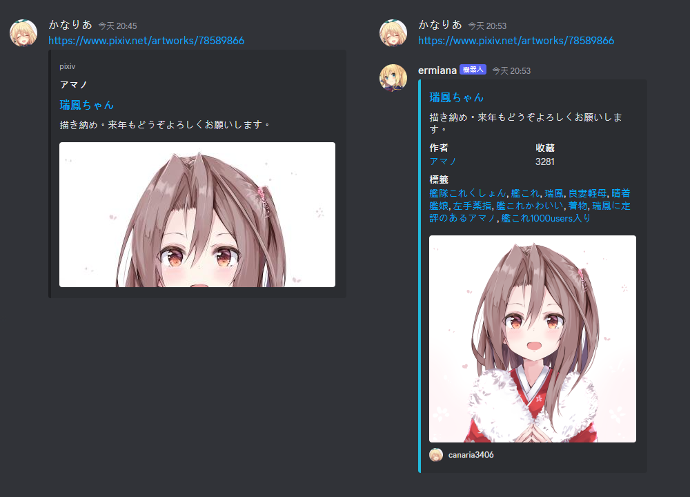
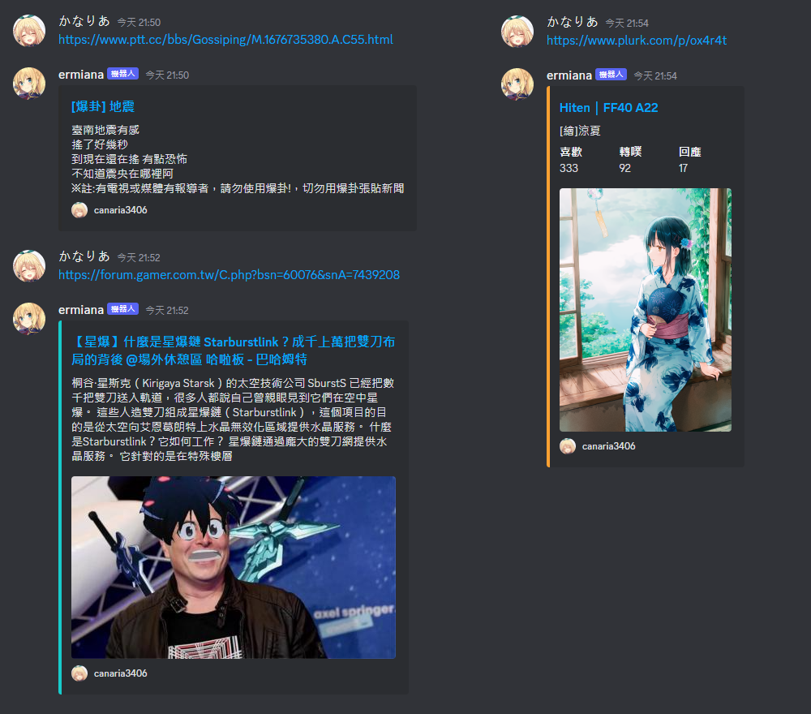
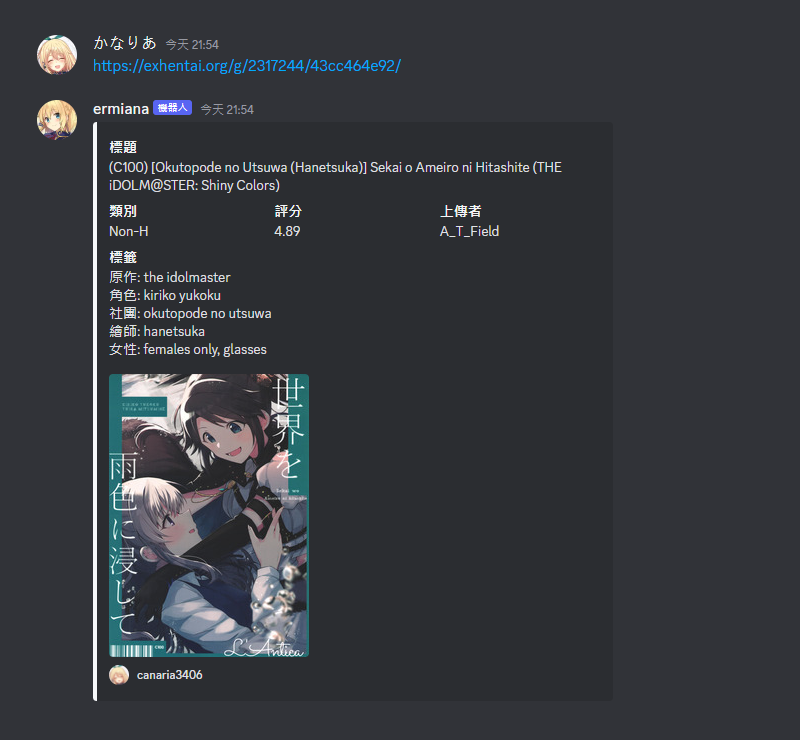
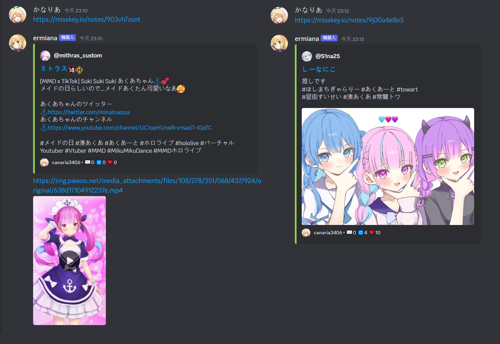
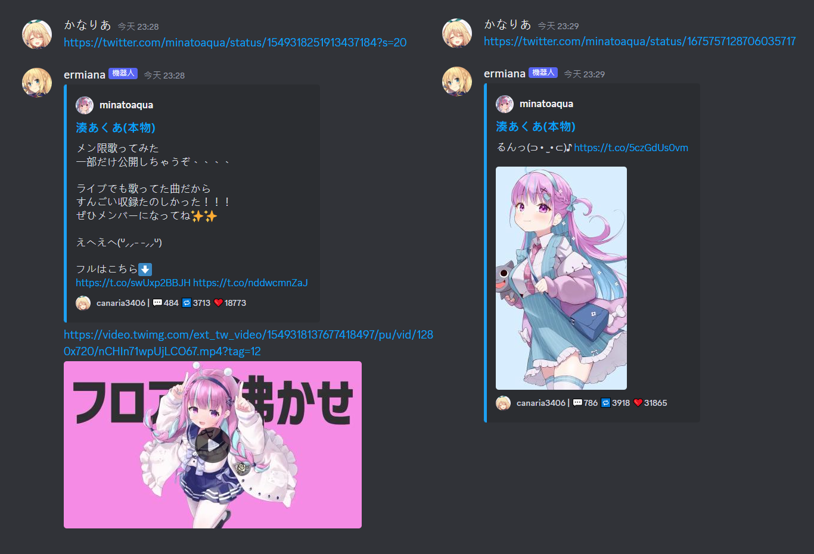

<h1 align="center">
    <br>
    ermiana
</h1>

<p align="center">
    <a href="https://github.com/canaria3406/ermiana/blob/master/LICENSE"></a>
    <a href="https://discord.com/api/oauth2/authorize?client_id=1078919650764652594&permissions=274878000128&scope=bot%20applications.commands"></a>
    <a href="https://github.com/canaria3406/ermiana/discussions"></a>
</p>

ermiana is a discord bot that converts unuseful webpage previews to more detailed image and webpage previews.  
Supports multiple websites such as ptt.cc, 巴哈姆特電玩資訊站, e-hentai, Plurk, Pixiv, and Twitter.



## Live Demo

[url.canaria.cc/ermiana](https://url.canaria.cc/ermiana)

## Getting Started

### Clone

```shell
git clone https://github.com/canaria3406/ermiana.git
```

### Settings

`.env`

## Screenshot









## Support

- [x] Community
  - [x] PTT.cc
    - [x] Gossiping
    - [x] AC_IN
  - [x] 巴哈姆特電玩資訊站
    - [x] 場外休憩區
  - [ ] Dcard
- [x] Social media
  - [x] Plurk
  - [x] Twitter
  - [x] Misskey
- [x] Image sharing service
  - [x] Pixiv
  - [x] e-hentai
  - [x] exhentai
  - [x] nhentai
